# IBM MQ NativeHA Cross Region Replication on RHEL

---

# Table of Contents
- [1. Introduction](#introduction)
- [2. Workshop Environments ](#workshop-env)
- [3. Recovery Environment Setup ](#recovery-setup)
  * [3a. Create Recovery Queue Manager ](#create-recovery-qm)
  * [3b. Copy TLS Certificates](#transfer-tls-certs)
  * [3c. Update qm.ini](#recovery-update-qm-ini)
  * [3d. Check Queue Manager](#recovery-qmgr-start)
  * [3e. Enable systemd Monitoring ](#recovery-systemd)
- [4. Enable Cross Region Replication ](#enable-crr)
  * [4a. Live Environment ](#live-enable-crr)
  * [4b. Recovery Environment ](#recovery-enable-crr)
- [5. Switching Roles ](#switch-roles)
- [6. Summary ](#summary)

---

<br>

## 1. Introduction <a name="introduction"></a>
In this lab, you will investigate the process of configuring the NativeHA Cross Region Replication (CRR) Queue Manager on RHEL Virtual Machines. Additionally, you will conduct High Availability testing in the Live environment, subsequently performing a failover to the Recovery environment and monitoring the transition of client connections from Live to Recovery.
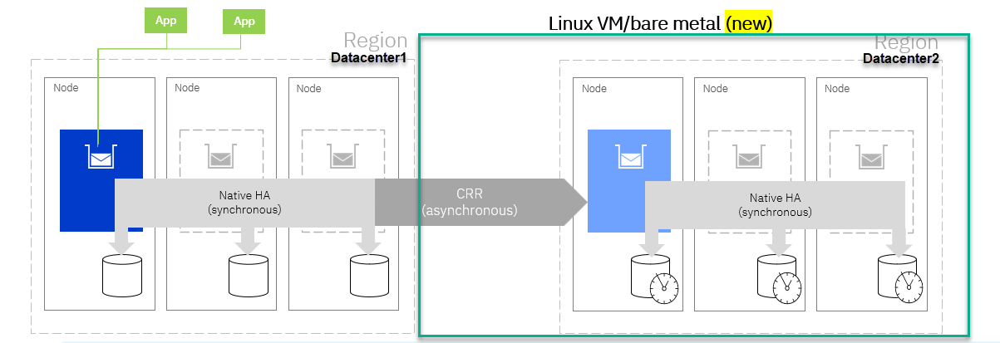
<br>

## 2. Workshop Environments  <a name="workshop-env"></a>

You need to reserve Techzone environment which will have 6 RHEL VMs, and 1 WIndows VM. <br>
For this lab we will be using acemq1,acemq2,acemq3 that we setup in the nativeha lab and also the following acemq4,acemq5,acemq6 for doing the MQ nativeHA/CRR. <br>
We will launch everything from the Windows image.

Click on the Windows image console to open it.

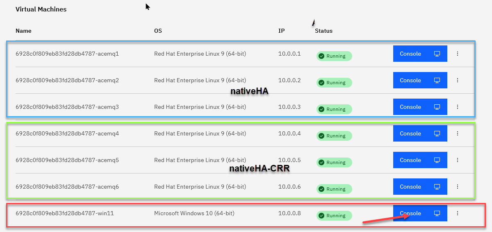
<br><br><br>


## 3. Recovery Environment Setup <a name="recovery-setup"></a>

**Note:** You should have completed the **nativeha-rhel** lab before continuing with this lab. 

 1.   From the Windows console click on the **CAD** to get to the login page.  Click on OK for the Business Use Notice

      

1. Login to the windows using techzone/IBMDem0s

   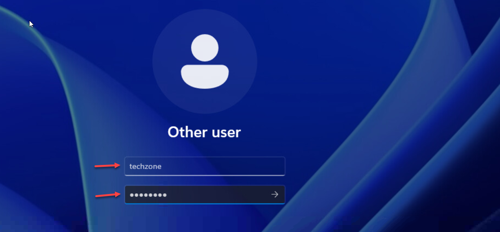

1. From the Windows VM's Console, open Putty program and open acemq1, acemq2, acemq3, acemq4, acemq5, acemq6 Virtual Machine sessions. <br>

   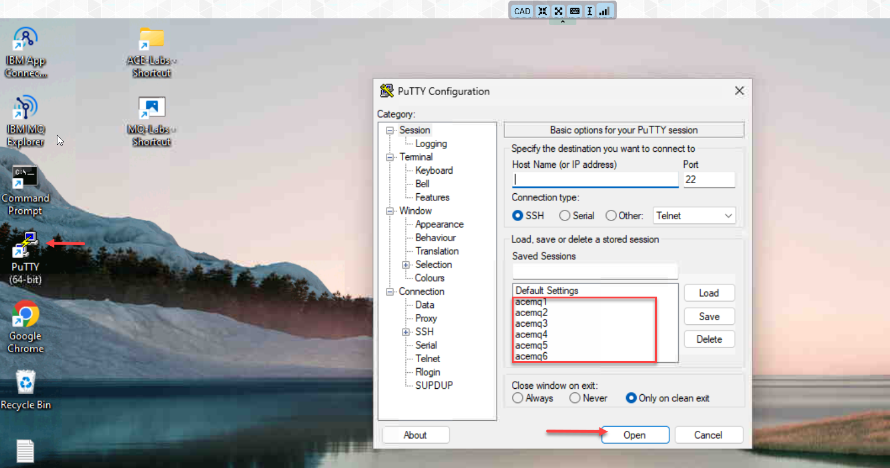

1. Arrange the windows on your desktop and you should have the all 6 RH vms.    

   Login to each VM using ibmuser/engageibm.

   We will focus in this lab setting up 4,5,6 for CRR
   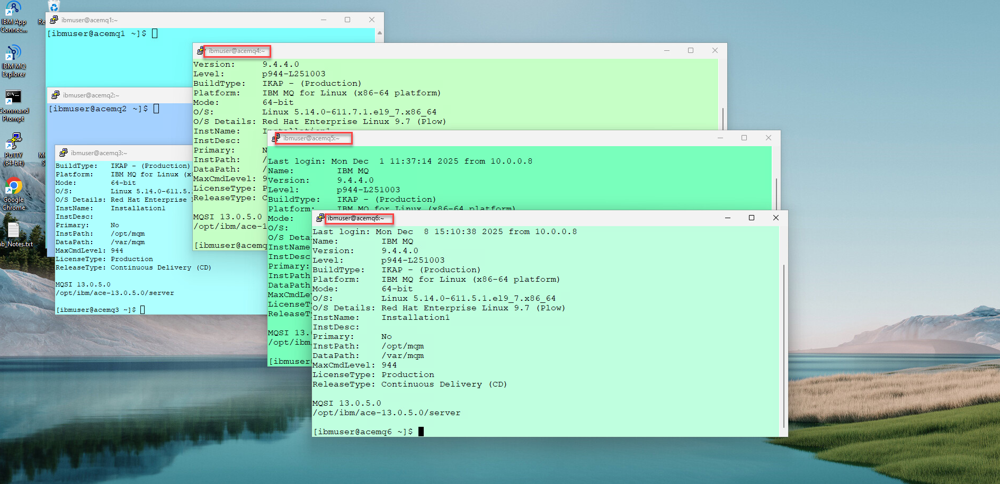

### 3a. Create Recovery Queue Manager <a name="create-recovery-qm"></a>

1. Run the following commands on each of the Virtual Machines (acemq4,acemq5, acemq6). <br>

Create Queue Manager MQ01HA <br>
```
crtmqm -lr `hostname` -lf 8192 -lp 10 -ls 10 -p 1414 MQ01HA
```

   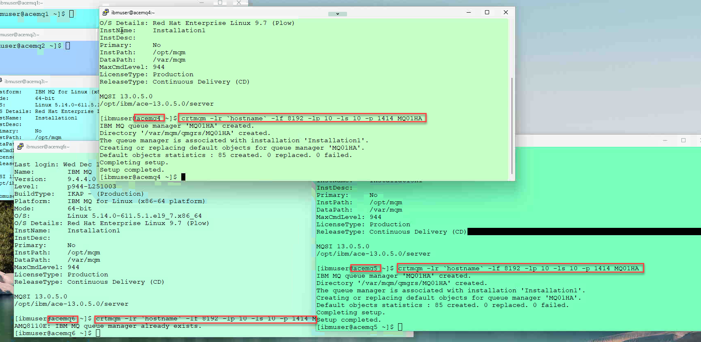
<br>


### 3b. Copy TLS Certificates  <a name="transfer-tls-certs"></a>

Copy (sftp) all key.* files from Live Environment (acemq1) to Recovery VMs acemq4, acemq5, acemq6. <br>

**From acemq1** <br>
1. Copy all key.* files to acemq4 Virtual Machines using sftp.   Login to acemq4 using password *engageibm* <br>

    ```
     sftp ibmuser@acemq4
    ```
    ``` 
    mput /var/mqm/qmgrs/MQ01HA/ssl/key.* /var/mqm/qmgrs/MQ01HA/ssl
    ```
    ```
      quit
      ```
1. Copy all key.* files to acemq5 Virtual Machines using sftp.   Login to acemq5 using password *engageibm* <br>
      ```
      sftp ibmuser@acemq5
      ```
      ```
      mput /var/mqm/qmgrs/MQ01HA/ssl/key.* /var/mqm/qmgrs/MQ01HA/ssl
      ```
      ```
      quit
      ```

1. Copy all key.* files to acemq6 Virtual Machines using sftp.   Login to acemq6 using password *engageibm* <br>
   ```
   sftp ibmuser@acemq6
   Enter password 
   ```
   ```
   mput /var/mqm/qmgrs/MQ01HA/ssl/key.* /var/mqm/qmgrs/MQ01HA/ssl
   ```
   ```
   quit
   ```
   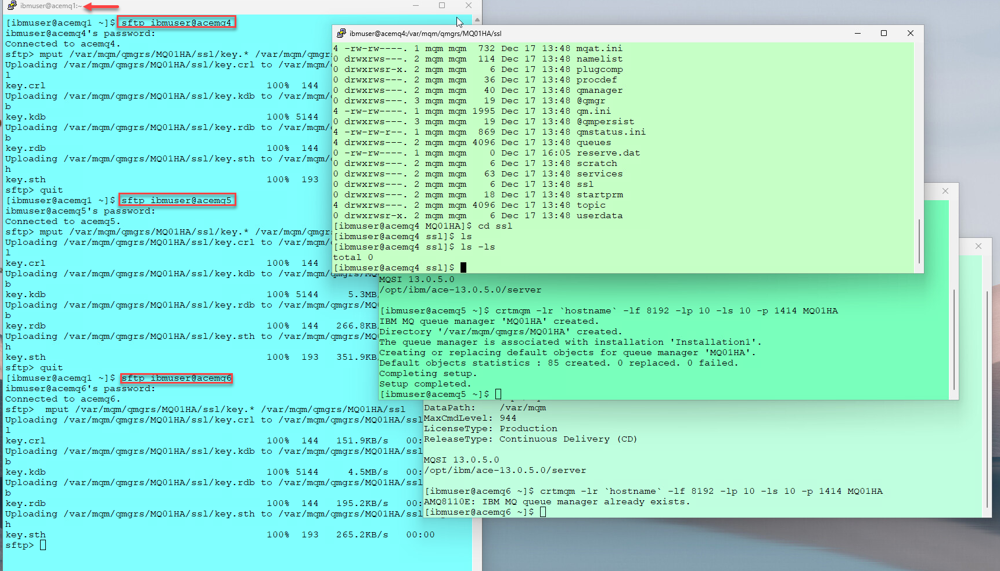

1. <b>Change TLS key.* file Permissions </b>

   On acemq4, acemq5, acemq6 run the following commands. <br>
   ```
   sudo chown -R :mqm /var/mqm/qmgrs/MQ01HA/ssl/key.*
   sudo chmod g+r /var/mqm/qmgrs/MQ01HA/ssl/key.*
   ```
<br>

   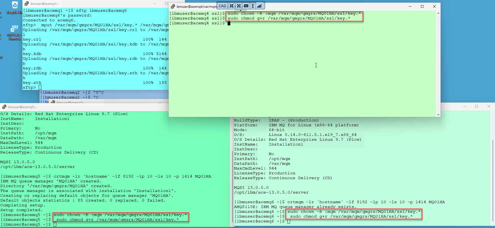

### 3c. Update qm.ini  <a name="recovery-update-qm-ini"></a>

1. On each VM (acemq4,5,6), we will add the TLS parameters as well as all 3 NativeHAInstances to qm.ini. 

   You can run the following command on all 3 images to look at the current **qm.ini** files.  

   ```
   cat /var/mqm/qmgrs/MQ01HA/qm.ini
   ```

   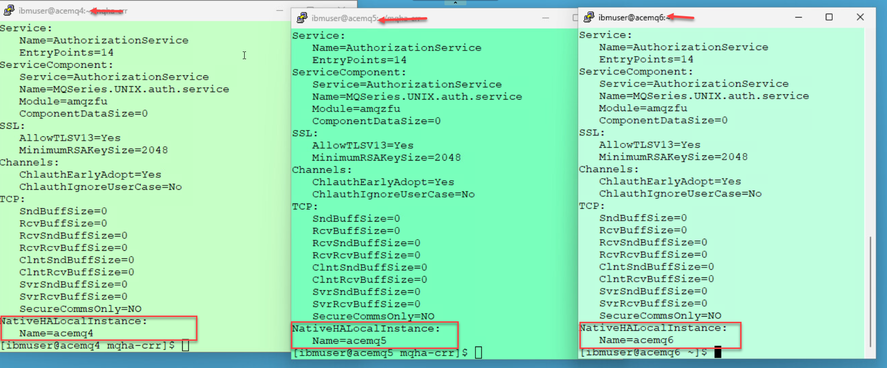
1. We will now from the **acemq4** putty session we will run the update script that will update all 3 qm.ini files on the 3 instances.

   The output will show that you have updated all 3 instances.  This will also start the QMgr on all 3 instances. 
   ```
   cd  mqha-crr
   ```
   ```
   ./2-qm-CRR.sh
   ```
   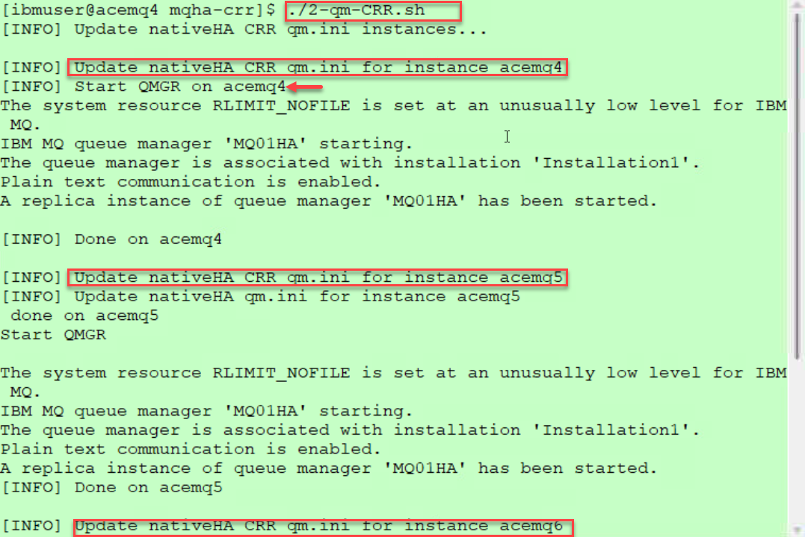

1. When done run the following command on all 3 instances to verify that the **qm.ini** was updated correctly. 

```
cat /var/mqm/qmgrs/MQ01HA/qm.ini
```

   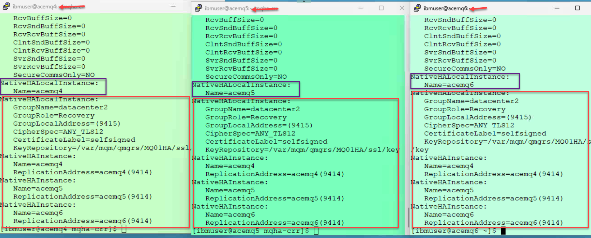

### 3d. Check Queue Managers <a name="recovery-qmgr-start"></a>

1. The QMgr should be running now and you can run the following command to check the status of the queue manager on for (acemq4,5,6). <br>

   ```
   dspmq -o nativeha -x
   ```

1. The Queue Manager should be active in one of Virtual Machines. When you run the dspmq commands you will see a leader and the other 2 will be Replica's

   **Note:** *In this screen shot acemq4 is the Leader*
 <br>

   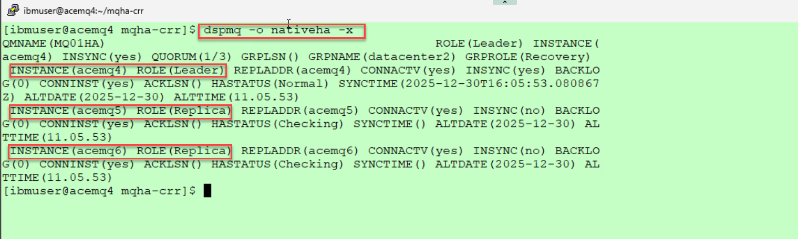

### 3e. Enable systemd Monitoring  <a name="recovery-systemd"></a>

Run the following commands on each RHEL VM. <br>
```
sudo ln -s /opt/mqm/samp/mqmonitor@.service /etc/systemd/system
sudo systemctl enable mqmonitor@MQ01HA
sudo systemctl start mqmonitor@MQ01HA
```

<br><br>

## 4. Enable Cross Region Replication  <a name="enable-crr"></a>


### 4a. Live Environment  <a name="live-enable-crr"></a>


1. Update qm.ini on all acemq1,2,3 VMs. <br>
   We will run the following script to update the qm.ini file on the live images. <br>
   This will also restart each QMgr instance. 

   ```
   ./3-qm-live-CRR.sh
   ```

   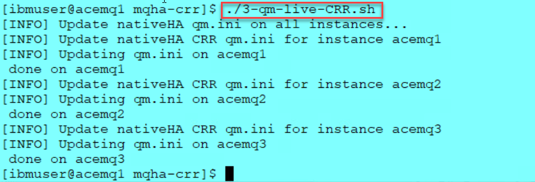
1. Run the following command on one of the Live instances to see what was added to the **qm.ini** file for the CRR replication. 

   ```
   cat /var/mqm/qmgrs/MQ01HA/qm.ini
   ```
   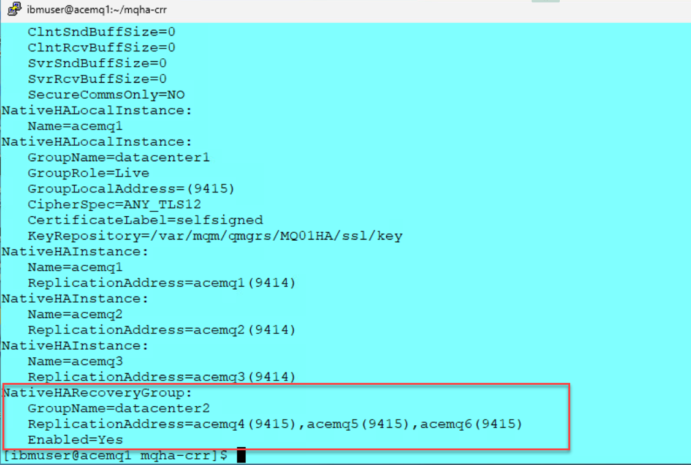

1. Run the following command to check the status of the queue managers. <br>
**Note:** This shows acemq2 is the active instance.

   ```
   dspmq -o nativeha -x
   ```
   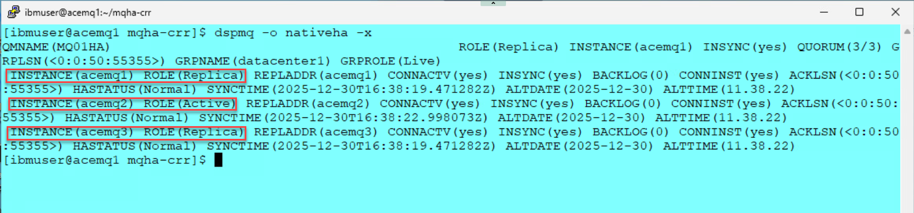

### 4b. Recovery Environment  <a name="recovery-enable-crr"></a>

1. Update qm.ini on all acemq4,5,6 VMs. <br>
   We will run the following script to update the qm.ini file on the Recovery images. <br>
   This will also restart each QMgr instance. 

   ```
   ./4-qm-recovery-CRR.sh
   ```

   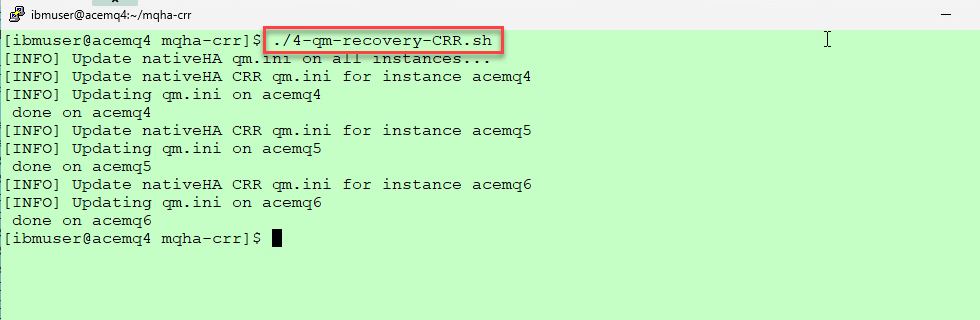

1. Run the following command on one of the Recovery instances to see what was added to the **qm.ini** file for the CRR replication. <br>
   **Note:** This is example shows acemq4 instance.

   ```
   cat /var/mqm/qmgrs/MQ01HA/qm.ini
   ```
   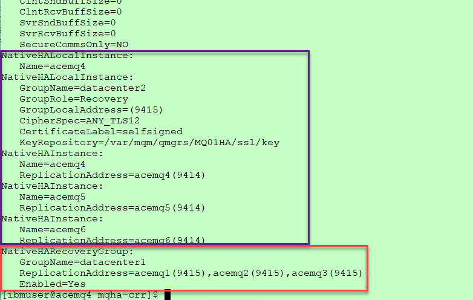

1. Run the following command to check the status of the Recovery queue managers (acemq4,acemq5,acemq6) <br>
**Note:** This shows acemq4 is the active instance. Also this is currently showing the **GRPROLE** as Recovery.

   ```
   dspmq -o nativeha -x
   ```
   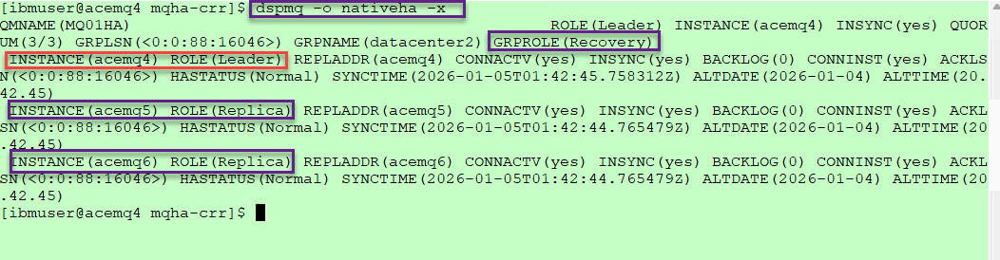


## 5. Switching Roles  <a name="switch-roles"></a>

1. We will now check the status of both are Datacenter deployments.  If this is the first time you should see **Datacenter1 - Live** and **Datacenter2 - Recovery**

   You can run the script in either Datacenter.  In this example we are showing the command running in both Datacenters but you only need to run it on one of the putty instances.  

   ```
   ./get-status.sh 
   ```
   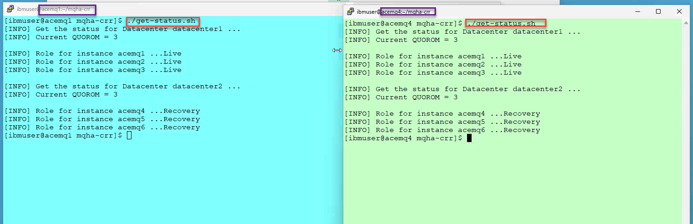

1. 
   Before we switch the Recovery Datacenter to be Live and Live Datacenter to be Recovery.  
   <br>
   First we will start the sample getter and putter for CRR.
   <br> 
      1) Open the mq shortcut on the windows desktop.
      2) Double click on the **MQ-CRR-getter** and **MQ-CRR-putter**
   <br>
   You will now see messages being put and get to the **APPQ** on the active QMgr.

   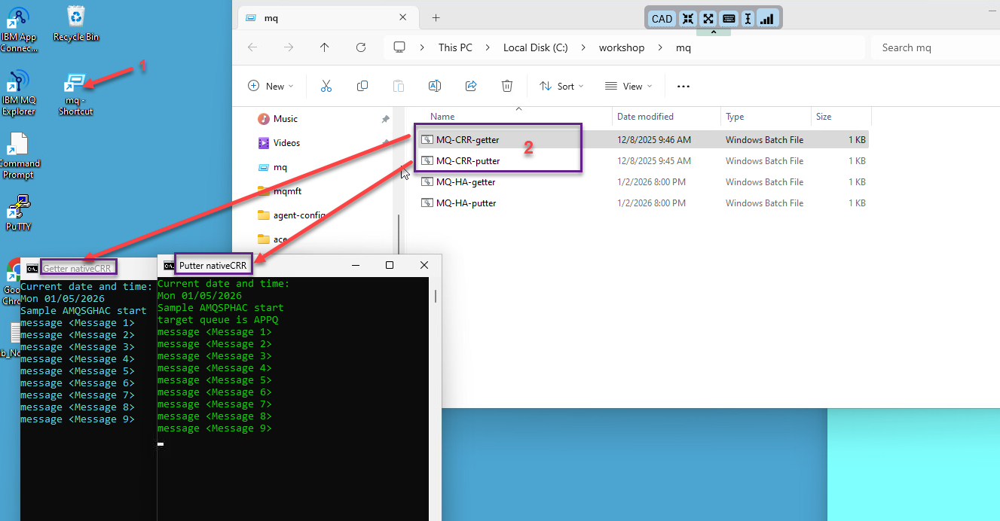
<br>

1. Run the following command from one of the putty instances and it will determine the current status and do the switch for each Datacenter as well as restart the QMgr on each instance.
   ```
   ./5-switch-crr.sh
   ```
    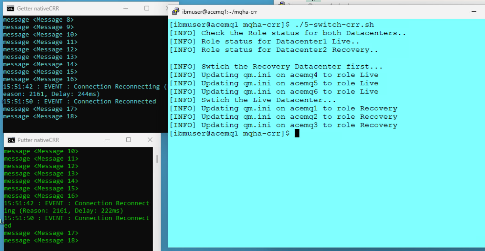

   **Note:** Here you will see the switch script will determine which is Live and which is Recovery.   It will then switch the Roles and restart the QMgr. 
   <br>
   You will also observe that the putter and getter programs will reconnect to the new active instance of the QMgr.
   <br> 
1. You can now run the ./get-status.sh again to see current status and then the ./5-switch-crr.sh to switch roles back. 
 
   ```
   ./get-status.sh
   ```
     ```
   ./5-switch-crr.sh
   ```
  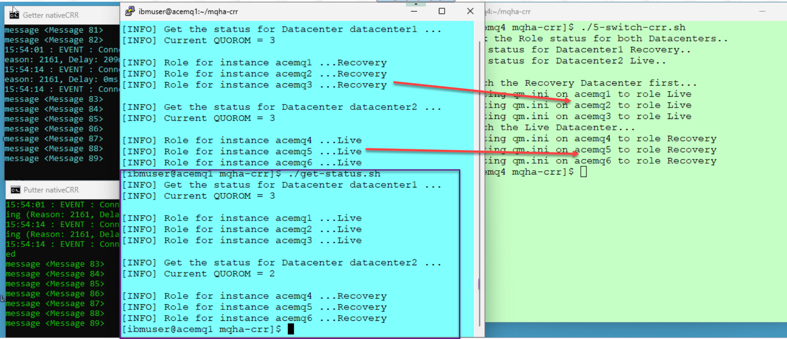


## 6. Summary <a name="summary"></a>

Congratulations! At this point, you ought to be familiar with the process of configuring IBM MQ Cross Region Replication between a Primary region and a Secondary region.


<!--
/* COMMENTED <br>
sed -e 's/NativeHALocalInstance:*/NativeHALocalInstance: \
   CipherSpec=ANY_TLS12 \
   CertificateLabel=selfsigned \
   KeyRepository=\/var\/mqm\/qmgrs\/MQ01HA\/ssl\/key/' /var/mqm/qmgrs/MQ01HA/qm.ini > /var/mqm/qmgrs/MQ01HA/qm.ini.modified
mv /var/mqm/qmgrs/MQ01HA/qm.ini.modified /var/mqm/qmgrs/MQ01HA/qm.ini
sudo chmod 660 /var/mqm/qmgrs/MQ01HA/qm.ini
sudo chown mqm:mqm /var/mqm/qmgrs/MQ01HA/qm.ini
<br>
-->