# IBM MQ NativeHA on RHEL

---

# Table of Contents
- [1. Introduction](#introduction)
- [2. Workshop Environments ](#workshop-env)
- [3. Live Environment Setup](#live-setup)
  * [3a. Create Queue Manager ](#create-live-qm)
  * [3b. Create TLS Certificates](#tls-setup)
  * [3c. Update qm.ini](#update-live-qm-ini)
  * [3d. Start Queue Manager](#live-qmgr-start)
  * [3e. Disable Security](#disable-security)
  * [3f. Enable systemd Monitoring](#live-systemd)
- [4. Testing High Availability (HA) in Live Environment](#testing-live-ha)
  * [4a. Put and Get messages (amqsphac, amqsghac)](#ha-put-get)
  * [4b. Failover the Queue Manager](#ha-failover)
- [5. Summary ](#summary)

---
[Return to Main Menu](../index.md)
<br>

## 1. Introduction <a name="introduction"></a>
In this lab, you will investigate the process of configuring the NativeHA Queue Manager on RHEL Virtual Machines. Additionally, you will conduct High Availability testing in the Live environment and monitoring the transition of client connections.

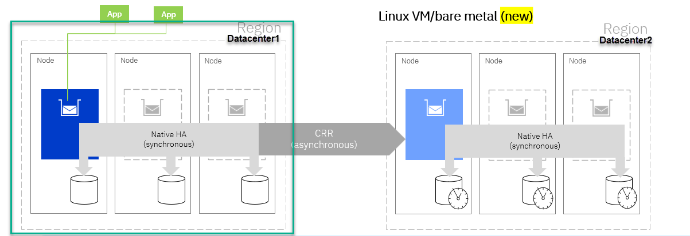
<br>

## 2. Workshop Environments  <a name="workshop-env"></a>

You need to reserve Techzone environment which will have 6 RHEL VMs, and 1 WIndows VM. <br>
For this lab we will be using acemq1,acemq2,acemq3 for doing the MQ nativeHA. <br>
We will launch everything from the Windows image.

Click on the Windows image console to open it.

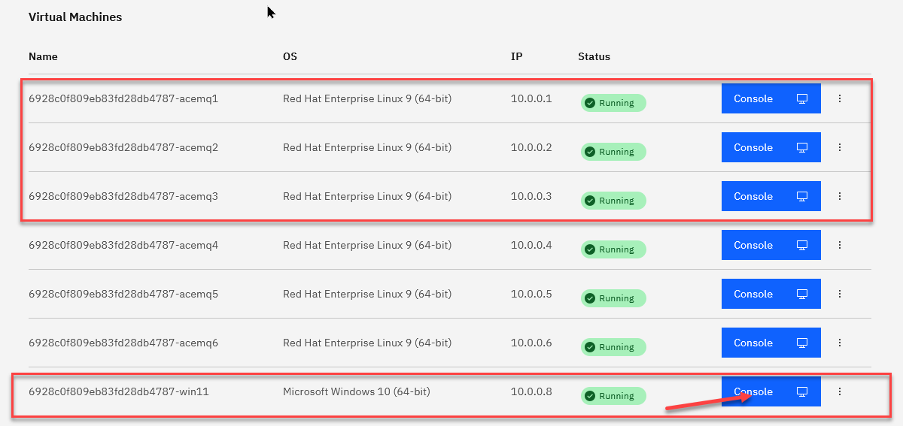

<br>


## 3. Live Environment Setup <a name="live-setup"></a>

1. From the Windows console click on the **CAD** to get to the login page.  Click on OK for the Business Use Notice

   

1. Login to the windows using techzone/IBMDem0s

   

1. From the Windows VM's Console, open Putty program and open acemq1, acemq2, acemq3 Virtual Machine sessions. <br>
   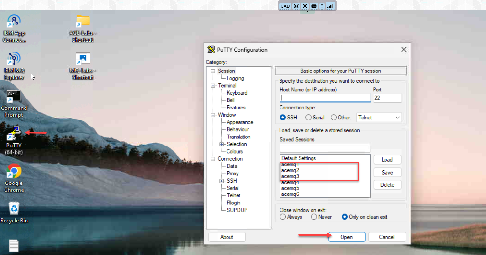

1. Arrange the windows on your desktop and you should have the 3 RH vms.    Login to each VM using ibmuser/engage.
   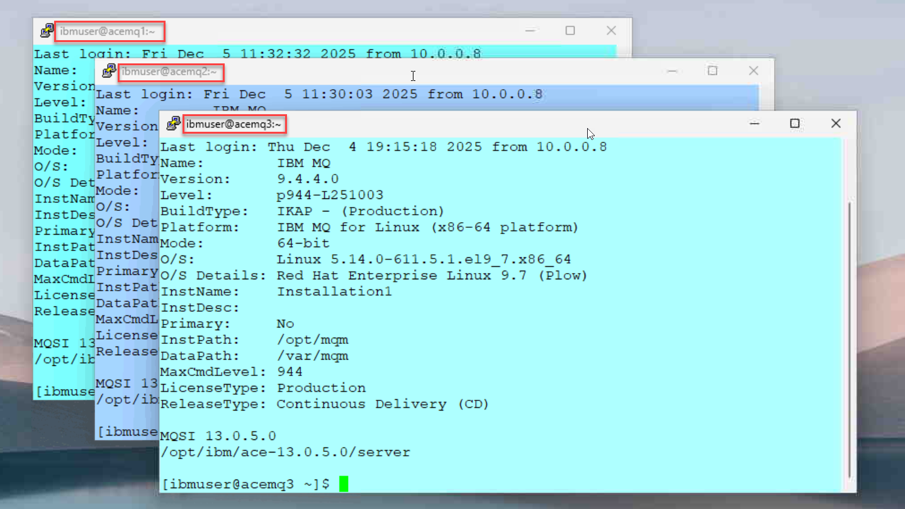


### 3a. Create Queue Manager <a name="create-live-qm"></a>

1. Run the following commands on each of the Virtual Machines (acemq1, acemq2, acemq3). <br>

   Create Queue Manager MQ01HA <br>
```
   crtmqm -lr `hostname` -lf 8192 -lp 10 -ls 10 -p 1414 MQ01HA
```
  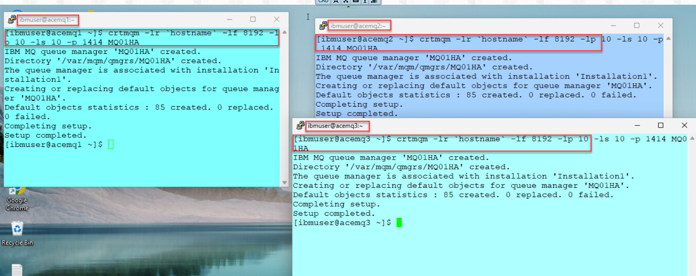

### 3b. Create TLS Certificates <a name="tls-setup"></a>

1. Run the below steps on **acemq1** to enable TLS on Queue Manager.  <br>
 Create TLS certificates. <br>
   ```
   runmqakm -keydb -create -db /var/mqm/qmgrs/MQ01HA/ssl/key.kdb -pw passw0rd -stash
   ```
   ```
   runmqakm -cert -create -db /var/mqm/qmgrs/MQ01HA/ssl/key.kdb -pw passw0rd -label selfsigned -dn CN=MQ01HA -size 2048
   ```
   ```
   sudo chown -R :mqm /var/mqm/qmgrs/MQ01HA/ssl/key.*
   ```
   ```
   sudo chmod g+r /var/mqm/qmgrs/MQ01HA/ssl/key.*
   ```
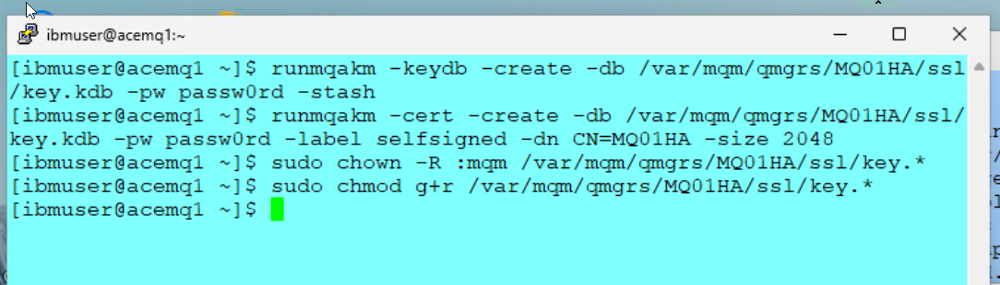

2. Copy all key.* files to acemq2 Virtual Machines using sftp.   Login to acemq2 using password *engageibm* <br>
   ```
   sftp ibmuser@acemq2
   ```
   ``` 
   mput /var/mqm/qmgrs/MQ01HA/ssl/key.* /var/mqm/qmgrs/MQ01HA/ssl
   ```
   ```
   quit
   ```
1. Copy all key.* files to acemq3 Virtual Machines using sftp.   Login to acemq3 using password *engageibm* <br>
   ```
   sftp ibmuser@acemq3 
   Enter password 
   ```
   ```
   mput /var/mqm/qmgrs/MQ01HA/ssl/key.* /var/mqm/qmgrs/MQ01HA/ssl
   ```
   ```
   quit
   ```
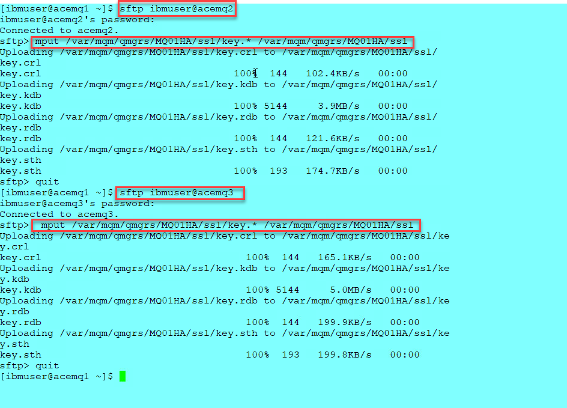

4. On acemq2, acemq3 run the following commands. <br>
   ```
   sudo chown -R :mqm /var/mqm/qmgrs/MQ01HA/ssl/key.*
   ```
   ```
   sudo chmod g+r /var/mqm/qmgrs/MQ01HA/ssl/key.*
   ```


### 3c. Update qm.ini <a name="update-live-qm-ini"></a>

1. On each VM (acemq1,2,3), we will add the TLS parameters as well as all 3 NativeHAInstances to qm.ini. 

   You can run the following command on all 3 images to look at the current **qm.ini** files.  

   ```
   cat /var/mqm/qmgrs/MQ01HA/qm.ini
   ```
   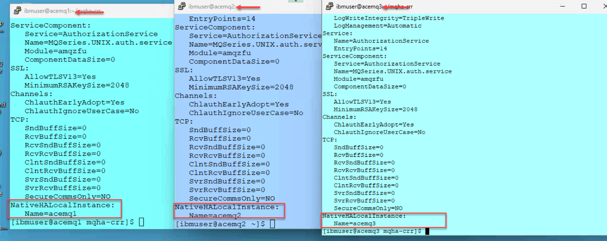
1. We will now from the **acemq1** putty session we will run the update script that will update all 3 qm.ini files on the 3 instances.

   The output will show that you have updated all 3 instances.
   ```
   cd  mqha-crr
   ```
   ```
   ./1-qm-ha.sh
   ```
   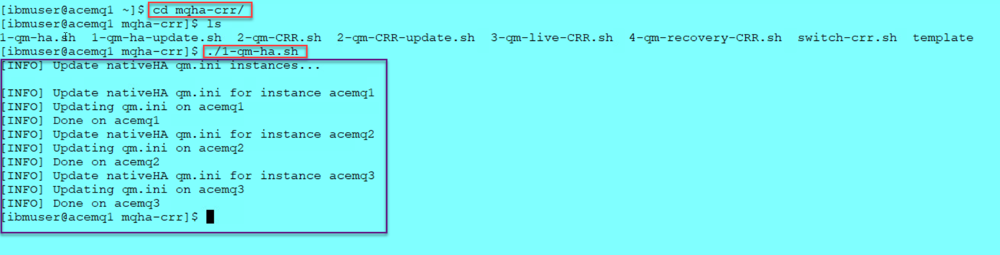

1. When done run the following command on all 3 instances to verify that the **qm.ini** was updated correctly. 

```
cat /var/mqm/qmgrs/MQ01HA/qm.ini
```

   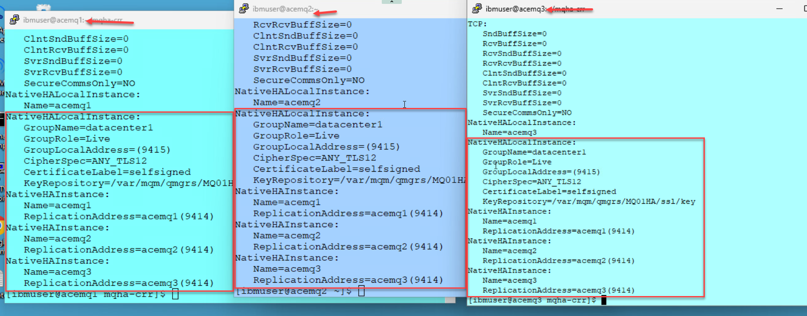


### 3d. Start Queue Manager <a name="live-qmgr-start"></a>

1. Run the following commands to restart the queue manager on all 3 vm's (acemq1,2,3). <br>

   ```
   strmqm MQ01HA
   ```
1. Once all 3 QMgrs are running go to one of the VMs and run the following command. 

   The Queue Manager should be active in one of Virtual Machines. <br>

   ```
   dspmq -o nativeha -x
   ```
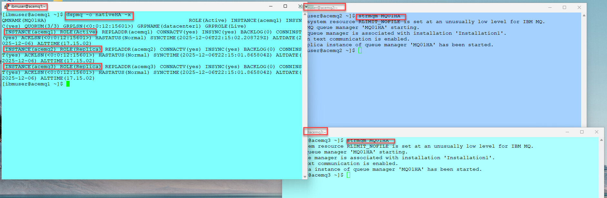

### 3e. Disable Security <a name="disable-security"></a>

1. Find the node that the QMgr is running as **Active** using this command.

   ```
   dspmq -o nativeha -x 
   ```

1. Run the following command, on the node where the queue manager is Active, <br>
This will disable security and define the channel and local Queue used for testing. 

```
runmqsc MQ01HA
ALTER QMGR CHLAUTH(DISABLED) CONNAUTH(' ')
REFRESH SECURITY TYPE(CONNAUTH)
DEFINE CHANNEL(NATIVEHACHL.SVRCONN) CHLTYPE(SVRCONN)
DEFINE QLOCAL(APPQ) DEFPSIST(YES)
```
<br>

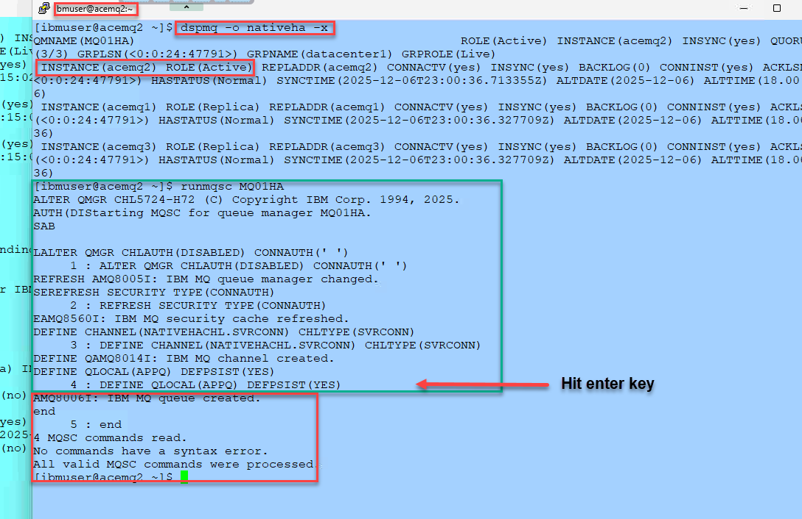

### 3f. Enable systemd Monitoring  <a name="live-systemd"></a>

Reference: <br>
https://www.ibm.com/docs/en/ibm-mq/9.4.x?topic=ha-monitoring-restarting-ending-queue-manager-instances
<br>

You must implement a method to ensure that the queue manager instances in the Native HA configuration are still running, and restart them if required.<br>

Run the following commands on each RHEL VM. <br>

```
ln -s /opt/mqm/samp/mqmonitor@.service /etc/systemd/system 
````
```
sudo systemctl enable mqmonitor@MQ01HA
```
```
sudo systemctl start mqmonitor@MQ01HA
```
<br>


## 4. Testing High Availability (HA) in Live Environment <a name="testing-live-ha"></a>

### 4a. Put and Get messages (amqsphac, amqsghac)  <a name="ha-put-get"></a>

1. **On the Windows VM** <br> 
   Open the **MQ-Labs** folder and start the **putter and getter** batch files. <br>

   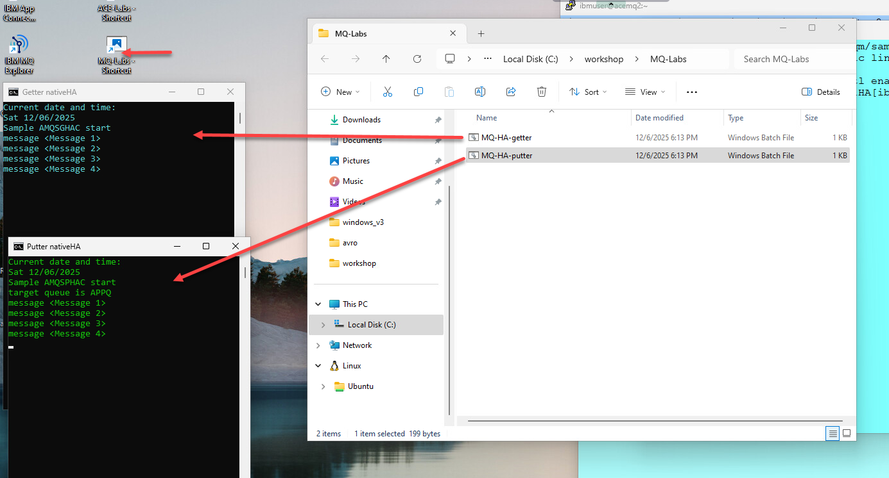

<br>


### 4b. Failover the Queue Manager  <a name="ha-failover"></a>

1. We will now manually failover the Queue Manager from where it's running. <br>
   Run **dspmq** on each of the RH VMs and you will see where the QMgr is currently running.  
   <br>
   Next from that location run the following command to failover the QMgr.  

   ```
   sudo systemctl restart mqmonitor@MQ01HA
   ```

   Notice that the amqsphac, amqsghac getting reconnected. <br>
   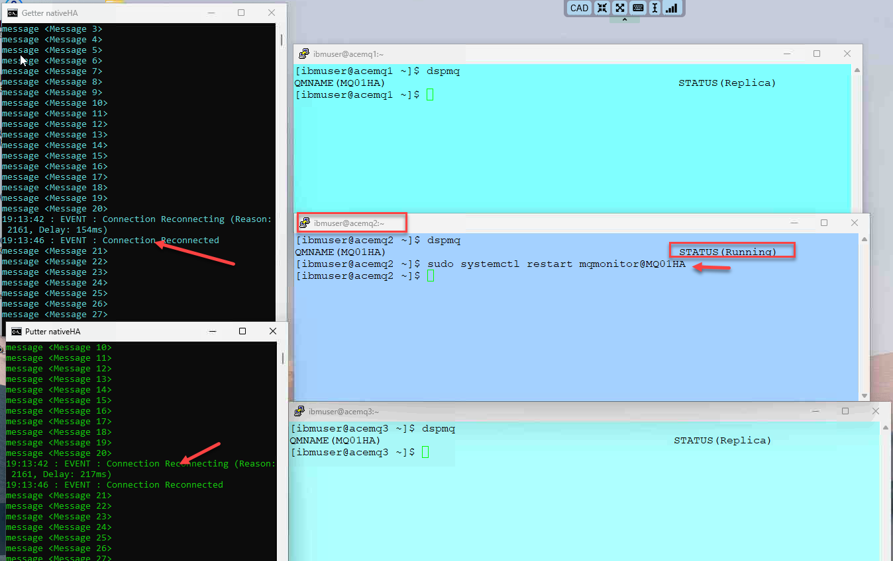

1. This indicates that the NativeHA is functioning as intended, and the queue manager is currently Active in a different Standby node, allowing the amqsphac and amqsghac to reconnect.

   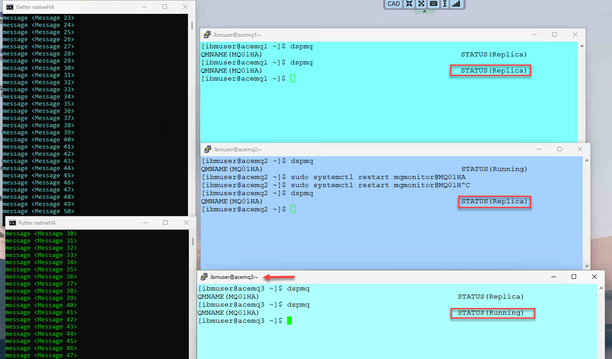
<br><br><br>


## 5. Summary <a name="summary"></a>

Congratulations! At this point, you ought to be familiar with the process of configuring IBM MQ HA in a Primary region.

<br>
[Return to Main Menu](../index.md)


<!--
/* COMMENTED <br>
sed -e 's/NativeHALocalInstance:*/NativeHALocalInstance: \
   CipherSpec=ANY_TLS12 \
   CertificateLabel=selfsigned \
   KeyRepository=\/var\/mqm\/qmgrs\/MQ01HA\/ssl\/key/' /var/mqm/qmgrs/MQ01HA/qm.ini > /var/mqm/qmgrs/MQ01HA/qm.ini.modified
mv /var/mqm/qmgrs/MQ01HA/qm.ini.modified /var/mqm/qmgrs/MQ01HA/qm.ini
sudo chmod 660 /var/mqm/qmgrs/MQ01HA/qm.ini
sudo chown mqm:mqm /var/mqm/qmgrs/MQ01HA/qm.ini
<br>
-->